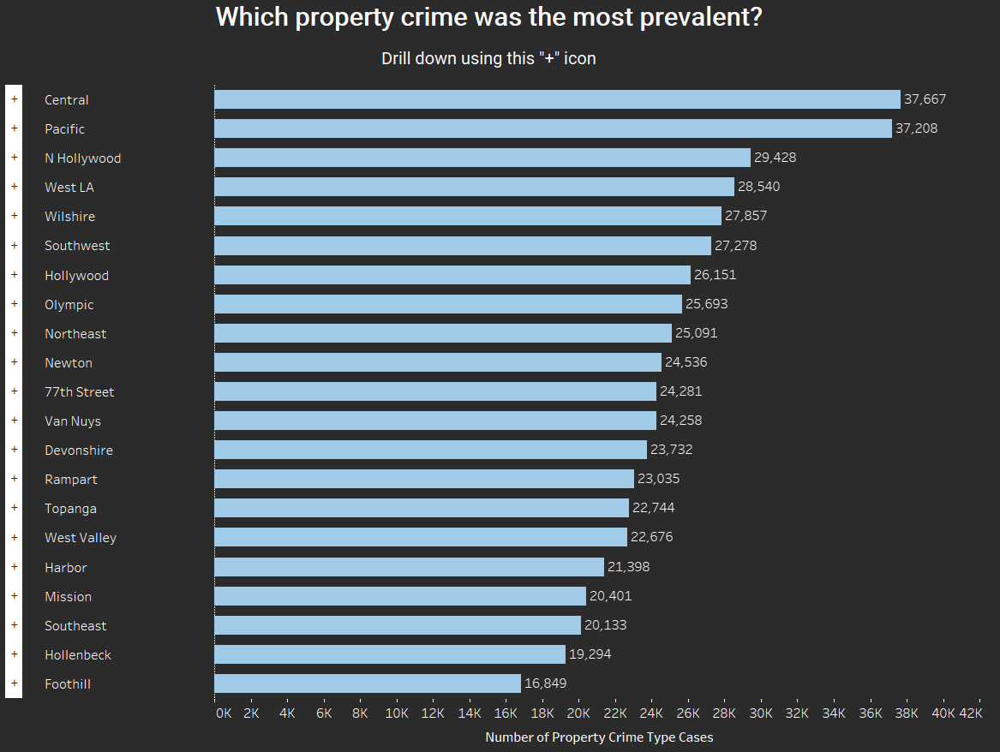

# Crime in Los Angeles - Tableau Dashboard

[Tableau Public Link](https://public.tableau.com/app/profile/shayan.razavi/viz/CrimeInLosAngelosv3/MainDashboardv2)

## Project Overview
This Tableau project provides an in-depth analysis of crime trends, patterns, and demographics in Los Angeles. By visualizing data from the LAPD (Los Angeles Police Department), the project aims to uncover insights about crime severity, distribution, and temporal patterns to aid decision-making and awareness.

## Objective
The objective of this analysis is to look at the broader picture of crime in Los Angeles, progressively narrowing the focus to specific topics and insights. This approach enables a better understanding of the dataset and its potential.

## Key Features

### Dashboards
1. **Main Dashboard v2**:
   - Displays crime severity by division.
   - Shows trends in crime reduction over time.
   - Highlights the balance of crime severity across divisions.
   - Identifies the most common and prevalent property crimes.
   - Explores dominant victim demographics, including ethnicity and gender.

### Visualizations
1. **Crime Divisions and Trends**:
   - A bar chart illustrating which divisions had the highest crime rates, with divisions such as Central, 77th Street, and Pacific leading the chart.
   - A timeline displaying the overall decline in crime incidents starting December 2023.

2. **Crime Severity Distribution**:
   - A stacked bar chart showcasing the proportion of low, medium, and high-severity crimes in different divisions. Central and Southeast divisions show significant high-severity crime proportions.

3. **Property Crime Analysis**:
   - A bar chart identifying property crimes as the most common crime type.
   - A Sankey diagram breaking down the subcategories of property crimes, such as vehicle-related theft and grand theft.

4. **Demographic Insights**:
   - A map visualizing the geographic distribution of victims based on ethnicity.
   - Pie charts and bar charts analyzing victim demographics, including ethnicity and gender. Hispanic/Latino individuals represent a significant proportion of victims, with insights into their foreign-born status.

### Insights
- **Temporal Trends**: A significant drop in crime incidents was observed post-December 2023, with consistent monthly trends in divisions like 77th Street and Central.
- **Crime Severity**: High-severity crimes are concentrated in specific divisions, highlighting areas for targeted intervention.
- **Property Crimes**: Vehicle-related theft dominates property crimes, followed by grand theft and other subcategories.
- **Demographics**: Hispanic/Latino individuals form a notable demographic among victims, linked to historical and regional population data.

## Data Sources
- **Crime_Data_from_2020_to_Present**: Historical crime data from the LAPD.
- **CaleforniaLatinoPopulation**: manually inputted data from migrationpolicy.org
- **LatinoPieChart**: manually inputted data from migrationpolicy.org

## How to Use This Repository
1. Clone the repository:
   ```bash
   git clone https://github.com/yourusername/crime-in-los-angeles.git
2. Open the Tableau workbook file (Crime In Los Angeles v2.twbx) in Tableau Desktop.
3. Navigate through the dashboards for an interactive exploration of the visualizations and insights.

## Screenshots





